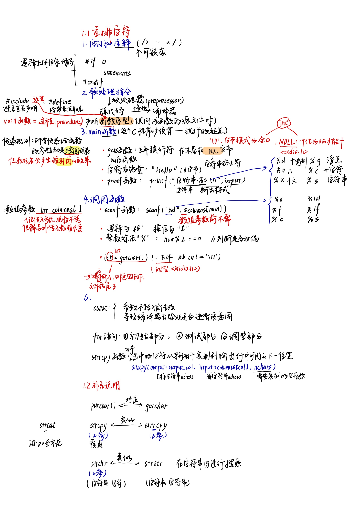
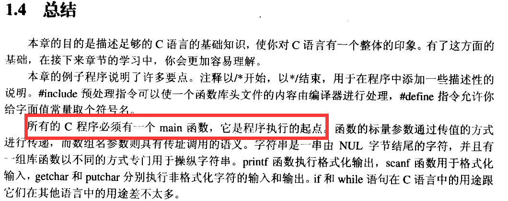

# 第一章：快速上手
## 本章总结及注意点


### 编程提示的总结
1. 使用#include 指令避免重复声明
2. 使用#define 指令给常量值取名
3. 在#include 文件中放置函数原型
4. 在使用下标前先检查它们的值
5. 在while或if表达式中蕴含赋值操作。
6. 如何编写一个空循环体。
7. 始终要进行检查，确保数组不越界。

## 问题及解答思考
1. 例子程序遵循了一定的空白使用规则，使程序更容易阅读，从而更容易维护。
2. 声明放在头文件中，声明只需要编写一次， 这样以后维护和修改它时会更容易。同样声明只编写一次消除了在多份拷贝中出现写法不一致的机会。
3. 使用#define指令给字面值常量取名，如果命名得当，命名常量比仅仅显示其值的字面常量更容易看出它代表什么。
4. 依次打印一个十进制整数、字符串和浮点值末尾并添加换行符：
   ``` c
    printf("%d %s %g\n");
   ```
5. 编写一条scanf语句，它需要读取两个整数，分别保存于quantity和price变量,然后再读取一个字符串，保存在一个名叫department的字符数组中。
   ``` c
    scanf("%d %d %s", &quantity, &price, department);
   ```
6. **C语言并不执行数组下标的有效性检查的原因**：程序员可以在需要的地方加入下标检查；在已经知道下标是正确的地方（例如，之前已经检查过），就不需要再次检查。但省略下标检查的真正原因是：下标是作为*指针表达式实现*的，第 8 章将对指针表达式进行介绍。
7. **如果用strcpy代替strncoy函数**：复制的字符数会多于实际需要的字符数；但是，output_ col 会被正确更新，因此下一个字符范围会被复制到输出数组的适当位置，替换掉前面操作中多余的字符。唯一的潜在问题是，无限制的 strcpy 复制到输出数组中的字符可能会超过它的容纳空间，从而破坏其他一些变量。
   ``` c
   strncpy( output + output_col, input + columns[col],
		    nchars );
   ```
8.  ``` c
      while( (ch = getchar()) != NULL );
    ```
   当一个数组作为函数的参数进行传递时，函数无法知道它的长度。
   ∴gets函数无法防止一个非常长的输入行，从而导致input数组溢出。
   fgets函数要求数组的长度作为参数传递给它，就不会出现此问题。

### 编程练习
5. ``` C
   /*
		** If the input line isn't this long or the output
		** array is full, we're done.
		*/
		if( columns[col] >= len ||
		    output_col == MAX_INPUT - 1 )
			break;
   ```
   当字符的列范围超出输入行的末尾时就停止复制，修改这句使列范围不是按列读取时也能正确完成任务：
   ``` C
      /*
		** 如果输入行没有那么长，跳过这个范围
		*/
		if( columns[col] >= len  )
			continue;
      /*
		** 如果输出数组已满，任务已完成
		*/
      if( output_col ==  MAX_INPUT - 1  )
            break;
		/*
		** If there isn't room in the output array, only copy
		** what will fit.
		*/
		if( output_col + nchars > MAX_INPUT - 1 )
			nchars = MAX_INPUT - output_col - 1;

      /*
		** 观察输入行中多少个字符在这个范围里面，如果< nchars,
		** 对nchars进行调整
		*/
		if( columns[col] + nchars - 1 >= len  )
			nchars = len - columns[col];
   ```

6. 修改rearrange程序，去除输入中列标号的个数必须是偶数的限制
   ``` C
      /*
      ** Process a line of input by concatenating the characters from the indicated
      ** columns. The output line is then NUL terminated.
      */

      /*
      ** Compute how many characters to copy.
      */
      if( col + 1 < n_columns )
      nchars = columns[col + 1] – columns[col] + 1;
      else
      nchars = len – columns[col + 1];
   ```

### 随笔

 `printf` 的格式化和骚操作，顺手找了两个官方文档：

- C++ 文档：[http://www.cplusplus.com/](http://www.cplusplus.com/reference/cstdio/printf/?kw=printf)
- C 文档，包含有 C++：[https://en.cppreference.com/](https://en.cppreference.com/mwiki/index.php?title=Special%3ASearch&search=printf&button=)

`printf` 的返回值是输出到屏幕的字符个数，故可以嵌套 `printf` 来输出一个整数的位数，很是秀...

`printf` 可以控制输出字符颜色，可以用这个功能实现一个简单的带颜色的日志系统，看着能养眼点。也是一个在黑框下独有的浪漫了。

至于后面就是简单的处理字符串相关函数，如： `strcpy`、`strncpy`、`strcat`、`strstr`、`strchr` 等等，只是简单的了解下。

