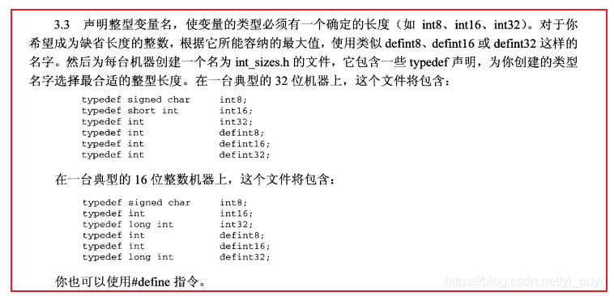
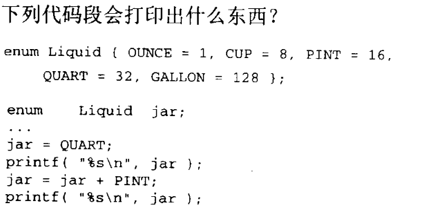

# 第三章：基本概念
## 本章总结及注意点
.PNG)
AIO6.png)
.PNG)
## 问题及解答思考
1. 在你的机器上，字符的范围是多大？，有哪些不同的整数类型？它们的范围又是如何？  
   见 demo1.c 即可。包含了 <limits.h> 后自行查看即可。也可以直接去查看 <limits.h> 中到底是怎样定义的  
   - 输出：
    ```
        2147483647
        -2147483648

        127        
        -128       
        255        

        2147483647
        -2147483648
    ```
2. 各种不同类型浮点数的范围见<float.h> 中的定义即可。 
3. 如果想让变量（16位、32位）在任何一台机器上的长度都合适的话，该如何声明？（试试包含一个头文件，里面包含每台机器特定的声明）
   
4. 假定你有一个程序，它把一个long整型变量赋值给一个short 整型变量。当你编译程序时会发生什么情况?当你运行程序时会发生什么情况?你认为其他编译器的结果是否也是如此?  
    warning 警告。只要能放下也无所谓。否则，根据各个编译器自己的规矩来，可能溢出，可能直接丢弃高阶位，这些情况都是有可能的。
5. 假定你有一个程序， 它把一个double 变量赋值给一个float变量。当你编译程序时会发生什么情况?  
   **精度丢失**。warning 警告。对于整数，如果能装得下，那就直接装就行了。如果装不下，这就取决编译器是怎么实现该情况的了。对于浮点数，需要查看指数和尾数能否装得下，否则依旧看编译器是怎么处理的。
6. 编写一个枚举声明，用于定义硬币的值。请使用符号PENNY、NICKEL等。
    ``` C
    enum Change { PENNY = 1, NICKEL = 5, DIME = 10, QUARTER = 25, HALF_DOLLAR = 50, DOLLAR = 100 };
    ```
7.   
    不确定。**枚举类型是拿整型来存储的**，但是这里是 %s 格式化字符串打印，则输出是不确定的。如果是 %d 则输出 32 48。
8. 你所使用的C编译器是否允许程序修改字符串常量?是否存在编译器选项，允许或禁止你修改字符串常量?  
   不允许。vs2019 应该可以看，vscode 还没摸索这个问题。
9.  如果整数类型在正常情况下是有符号类型，那么signed关键字的目的何在呢?  
    适用于字符类型。显示定义字符变量，保证一致性。
10. 一个无符号变量可不可以比相同长度的有符号变量容纳更大的值?  
    所能表示的数的范围都是一样的。只不过区别在于对于一半数是如何解释的
11. 假如int和float类型都是32位长，你觉得哪种类型所能容纳的值精度更大一些?  
    float 作为浮点型范围比 int 大。
    float 长度 32 位，其中 1 位是符号位，8 位是幂，剩下的 23 位是尾数。如果位数相同，那么它们能表示的不同值的数量应该也是相同的。但是由于浮点数系统中一个数有多种表示方式。譬如，0 就有很多种表示方式，所以*在表示不同值的数量上 float 比 int 少*。
12. 下面是两个代码片段，取自一个函数的起始部分。它们完成任务的方式有何不同?  
    ``` C
    int a=25;
    ```
    ``` C
    int a;
    a=25;
    ```
    没啥不同。显示初始化就是将两个合到一起罢了，在定义的时候隐式的插入了一条赋值语句而已。
13.  如果问题12中代码片段的声明中包含有const 关键字，它们完成任务的方式又有何不同？  
    左边仍旧可以。右边错误，不能该一个常量赋值。
14.  在一个代码块内部声明的变量可以从该代码块的任何位置根据名字来访问，对还是错?  
    错。若嵌套代码块中包含了同名变量，那么外层同名变量将被隐藏。
15.  假定函数a声明了一个自动整型变量x，你可以在其他函数内访问变量x，只要你使用了下面这样的声明:
```extern int X ; ```
对还是错?  
    错。代码块中的局部变量永远不能从其它代码块中按名称直接访问。
16.  假定问题15中的变量x被声明为static。你的答案会不会有所变化?   
    错。static 延长所修饰变量的生命周期，更改其存储类，但并不会更改其作用域。答案仍旧错误。
17.  假定文件a.c的开始部分有下面这样的声明:
``` int X; ```
如果你希望从同一个源文件后面出现的函数中访问这个变量，需不需要添加额外的声明，如果需要的话，应该添加什么样的声明?  
    这就是全局变量。不需要做任何操作。
18.  假定问题17中的声明包含了关键字static。你的答案会不会有所变化?  
    不会。仍然有内部链接。本文件后的所有函数均可以访问。
19. 假定文件a.c的开始部分有下面这样的声明:
``` int X; ```
如果你希望从不同的源文件的函数中访问这个变量，需不需要添加额外的声明,
如果需要的话，应该添加什么样的声明?  
    需要，添加```extern int x;```
20.  假定问题19中的声明包含了关键字static。 你的答案会不会有所变化?  
    会。static 和 extern 两者就是矛盾的。 static 修饰本文件内的变量，在函数中的是静态变量。而 extern 表示的是其他文件定义的变量，显然两者是矛盾的。且单单用 static 来声明，却想获取其他文件的全局变量是不可能的。
21.  假定一个函数包含了一个自动变量，这个函数在同一行中被调用了两次。试问，在函数第2次调用开始时该变量的值和函数第1次调用即将结束时的值有无可能相同?  
    可能相同。函数内自动变量在堆栈中用完即销毁。第二次调用可能仍分配同样地址造成结果相同。但是堆栈信息被破坏时，这些变量的信息也将被破坏。只是巧合而已。
22.  当下面的声明出现于某个代码块内部和出现于任何代码块外部时，它们在行为上有何不同?  
```int a=5;```
     - 内部：自动变量，每次调用函数都将被重新初始化，作用域仅在该函数内部，无连接。
     - 外部：静态变量，只初始化一次，在程序开始之前，具有文件范围和外部链接。
23.    假定你想在同一个源文件中编写两个函数x和y,需要使用下面的变量:
    
      
    见 demo2.c。个人觉得，static char b = 2; 其链接属性应该是 internal。而不应该是 none，毕竟要求 x 和 y 都要能访问到。
24. 有一个错误：第 6 行中 c 的声明与函数参数 c 冲突编译器将第 4 行标记为错误，称其与中的声明冲突;第 20 行这不应该是一个错误，因为第 20 行中 y 的范围在第 22 行用完了，因此不是冲突。
    ``` C
    static int W=5;
    extern int X;
    Static float func1 ( int a，int b,intC){
        int C，d,e=1; //标记为错误，称其与中的声明冲突
        {
        int d，e，W;
            {
                int b，C，d;
                static int y=2;
            }
        }
        {
            register int a, d, x;
            extern int y;
        }
    }
    static int y;

    float func2( int a ){
        extern int y;
        static int z;
    }
    ```


