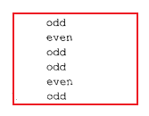
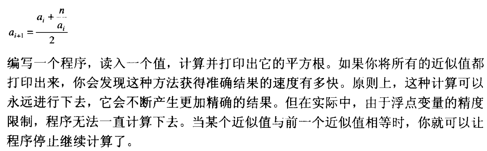
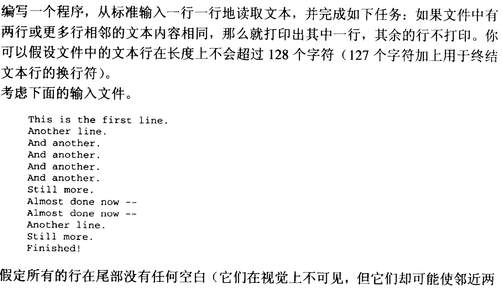

# 第四章：语句
## 本章总结及注意点
.PNG)
## 问题及解答思考
1. 合法。可以正确执行，但是对程序不造成任何影响。这些操作符均不具有副作用，计算结果没有赋给任何变量。
2. 赋值语句的语法是怎么样的？  
   事实上 C 没有 赋值语句。赋值是用赋值运算符表达式语句完成的。如 a = b + c;
3. 合法。确实没这样用过。代码块中定义局部变量，可将这些变量的访问及生存周期限制在本代码块中。想来也是一个很不错的操作！
4. 使用空语句。或者修改代码逻辑
5. 输出 0~9 之间的整数。
6. 在没有初始化或者调整表达式的时候，即 for 循环的第一部分、第三部分。此时，相较于 for 循环来讲，while 更加方便。
7. 忘记加 { }，中间字符不打印，只会打印 EOF 和校验和。然而 EOF 这个字符是无效的。
8. 当循环体必须执行一次的时候，使用do语句比使用while语句更加合适。
9. IMARHTR`UR.png)  
    不存在 break 语句，即为：
10. 编写一些语句，从标准输入读取一个整型值，然后打印-些空白行，空白行的数量由这个值指定。    
    ``` C
        #include <stdio.h>
        int main() {
            int n;
            scanf("%d", &n);
            for (int i = 0; i < n; ++i)
                puts("");
            return 0;
        }
    ```
11. 编写一些语句，用于对一些已经读入的值进行检验和报告。如果x小于y,打印单词WRONG.同样，如果a大于或等于b,也打印WRONG。在其他情况下，打印RIGHT。注意:||操作符表示逻辑或，你可能要用到它。  
    ``` C
    #include <stdio.h>
    int main() {
        int x, y, a, b;
        scanf("%d%d%d%d", &x, &y, &a, &b);
        
        if (x < y || a >= b)
            puts("WRONG");
        else
            puts("RIGHT");

        return 0;
    }
    ```
12. 能够被4整除的年份是闰年，但其中能够被100 整除的却不是闰年，除非它同时能够被400整除。请编写一些语句，判断year这个年份是否为闰年，如果它是闰年，把变量leap_year设置为1，如果不是，把leap_ year设置为0。  
    ``` C
    #include <stdio.h>
    int main() {
        int year;
        scanf("%d", &year);

        int leap_year = 0;
        if (((year % 4 == 0) && (year % 100 != 0)) || (year % 400 == 0)) //关键
            leap_year = 1;
        else
            leap_year = 0;

        printf("%d\n", leap_year);
        return 0;
    }
    ```
13. 新闻记者都受过训练，善于提问谁?什么?何时?何地?为什么?请编写一些语句，如果变量which_word的值是1， 就打印who; 如果值为2, 打印what,
，依次类推。如果变量的值不在1到5的范围之内，就打印don't know。 
    ``` C
    #include <stdio.h>
    int main() {
        int which_word;
        scanf("%d", &which_word);

        switch (which_word) {
        case 1:
            puts("who");
            break;
        case 2:
            puts("what");
            break;
        case 3:
            puts("when");
            break;
        case 4:
            puts("where");
            break;
        case 5:
            puts("why");
            break;
        default:
            puts("don't know");
            break;
        }
        return 0;
    }
    ```
14.  假定由一个“程序”来控制你，而且这个程序包含两个函数: 
eat_ hamburger()用于让你吃汉堡包，hungry()函数根据你是否饥饿返回真值或假值。请编写一些语句，允许你在饥饿感得到满足之前爱吃多少汉堡包就吃多少。   （while 循环的使用）
   ``` C
    #include <stdio.h>
    int main() {
        while (hungry())
            eat_hamburger();
        return 0;
    }
   ```  
15.  修改你对问题14的答案，使它能够让你的祖母满意——就是你已经吃过一些东西了。也就是说，你至少必须吃一个汉堡包。 （do-while 语句） 
   ``` C
    #include <stdio.h>
    int main() {
        do {
            eat_hamburger();
        } while (hungry());

        return 0;
    }
   ```  
16.   编写一些语句,根据变量precipitating和temperature的值打印当前天气的简单总结。  
    
    
   ``` C
    #include <stdio.h>
    int main() {
        int precipitating, temperature;
        scanf("%d%d", &precipitating, &temperature);

        if (precipitating) {
            if (temperature < 32)
                puts("snowing");
            else
                puts("raining");
        } else {
            if (temperature < 60)
                puts("cold");
            else
                puts("warm");
        }
        return 0;
    }
   ```  

### 编程练习
1. 正数n的平方根可以通过计算一系列近似值来获得，每个近似值都比以前更加接近准确值。第一个近似值是1，接下来的近似值通过下面的公式来获得。
     
   double 接收输入。浮点数判等比较方法。见 demo1.c。
2. 一个整数如果只能被它本身和1整除，它就被称为质数(prime)。请编写一个程序，打印出1~100之间的所有质数。  
   简单的试除法求质数。注意在表达式运算中模数和除数都不能为 0。见 demo09.c。
3. 等边三角形的三条边长度都相等，但等腰三角形只有两条边的长度是相等的。如果三角形的三条边长度都不等，那就称为不等边三角形。请编写一个程序，提示用户输入三个数，分别表示三角形三条边的长度，然后由程序判断它是什么类型的三角形。提示:除了边的长度是否相等之外，程序是否还应考虑一些其他的东西?  
   double 三个变量接收输入。降序排序，比较即可。见 demo10.c。
4. 编写函数copy_n，它的原型如下所示：
   {C_M[5]3%Z7NUQW(4.png>)  
   这个代码还是好实现的。但是也产生了一个问题。当我 char a[10] = "0123456789" 的时候，我的 a 数组元素被刚好占满，那么最后的 \0 就无处放置。此时恰好 b 数组续到了 a 数组的后面，导致也文件中的错误打印。也是一个经典错误了！所以，一定需要给 \0 留上空间。见 demo11.c。
5.   
     
   4VO4%)7XR[QDHT)1TK.png>)  
   挺不错的一道题。gets 接收整行输入字符串，strcmp 比较两字符串相等，strcpy 进行字符串拷贝更新。尤其需要注意判断 flag 排除掉后续重复字符串仍继续打印的错误情况。见 demo12.c。
6.  
   %7PG(}_]SOIZ[MC.png>)  
   经典的实现 substr。因为这个代码简短，且考查的细节也是蛮多的。例如合法性的判断，dst 数组末尾补上 \0，都是很细节的知识点。**面试常考**。 见 demo13.c。
7.   
     
   三星题。实现这个过程是简单的。很经典的双指针应用。但是我貌似没有考虑到特殊的转义字符，只考虑到了样例中包括字符和空格的情况。即制表符、换行符等等特殊字符都没考虑。不过这个确实也只需要加一个特殊的判断而已。基本功能拿双指针简单的实现了。见 demo14.c。